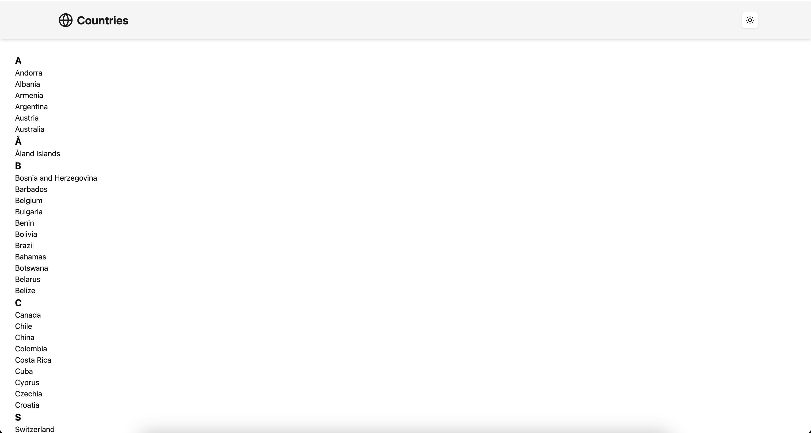
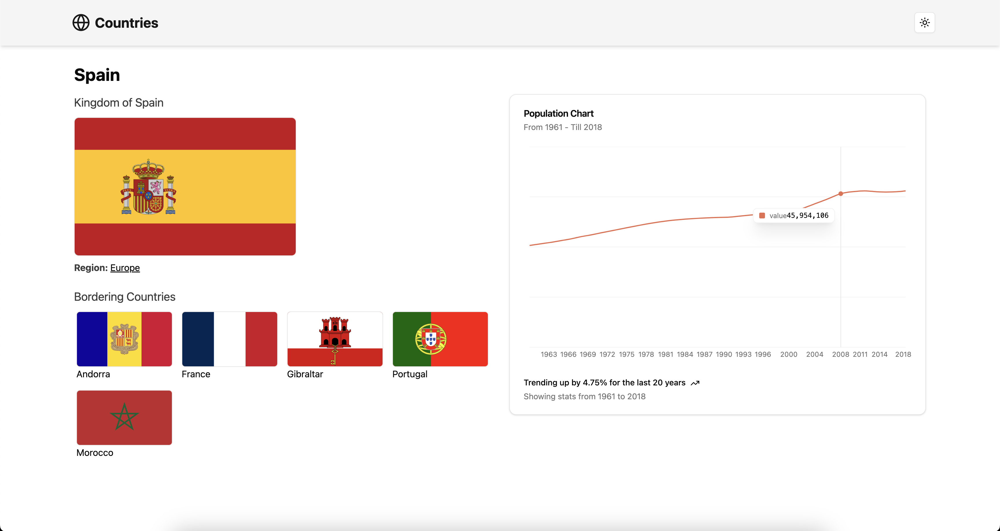
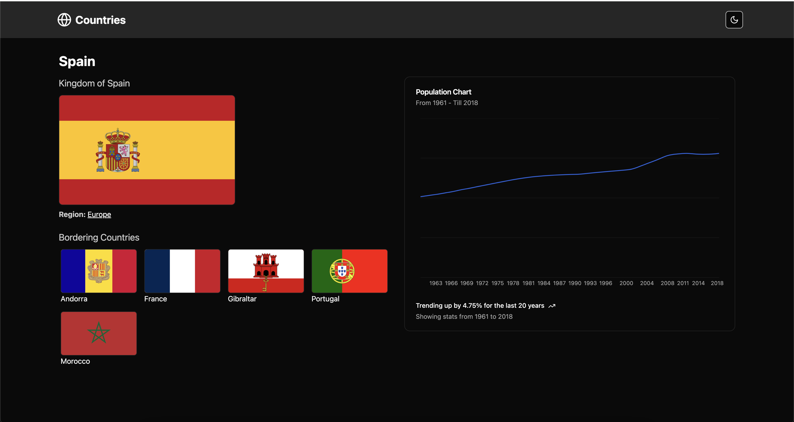

# Countries full stack app






This app is done with Nest.js for server part and Next.js for client.
It uses tailwind for styling, ShadCN components

Populataion is displayed with `recharts`

## How to setup

### Server

Move to server dir

```sh
cd ./server
```

Create `.env` file (and copy contnet there from `.env.example`)

```sh
touch .env
```

Install modules and run

```sh
npm i && npm run start:dev
```

### Client

Move to client dir

```sh
cd ./client
```

Create `.env` file (and copy contnet there from `.env.example`)

```sh
touch .env
```

Install modules and run

```sh
npm i && npm run dev
```
